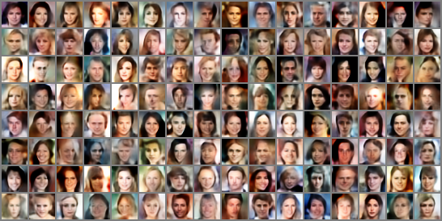
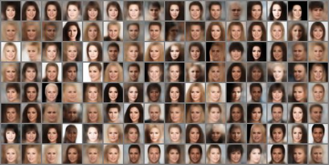
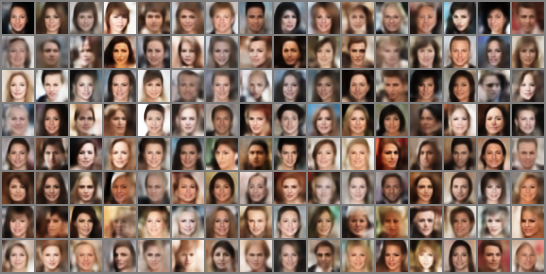
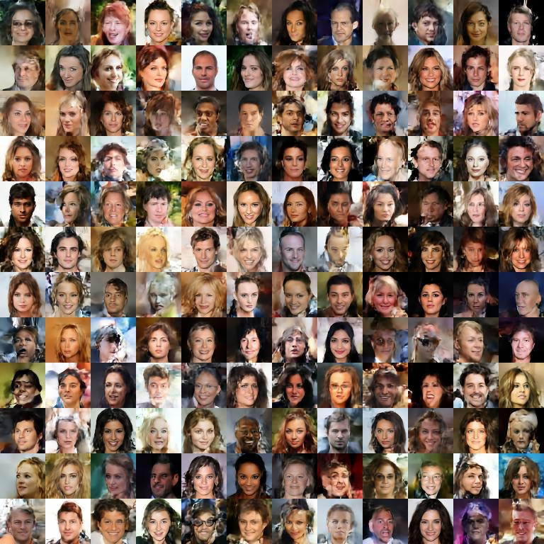

# 简介

基于无需学习的散射小波网络作为编码器的图像生成模型，原始散射小波特征训练的解码器

生成的图像可能存在部分结构不合理的问题。利用稀疏字典学习改进了这一问题，同时利用UNet

网络的思想进一步改进了类AE/VAE生成图像细节模糊的问题，尤其人脸图像人物头发细节模糊，

改进后生成图像细节有显著改善。

# 网络结构

   coming soon ...

# 环境和使用

   coming soon ...

# 初步改进实验结果对比 

        原始散射小波特征随机生成结果图 32*32        

                      

        稀疏化后散射小波特征随机生成结果图 32*32     

                    

        优化细节后散射小波特征随机生成结果图 32*32 

 

        解码器改进后散射小波特征随机生成结果图 64*64 

  
# 参考文献
 

